# Collected by Faldi: Implementation References

Use these images alongside [root design.md](../../design.md) and the [selected design rationale](../reference-design.md). The homepage is the visual anchor; the revised page and detail mockups carry the same composition into other routes.

One cohesive collection composition per archive page: unequal artifact sizes, overlapping large type, warm paper, near-black and sparse vermilion. Detail states retain that identity while allowing readable full content.

These are visual implementation references, not production assets. Replace generated photos, screenshots, covers, quotes, names, dates and copy with authentic, verified material. Do not use the whole mockup as a website background or treat its pictured controls as implemented behavior. Mobile reflow and interaction still require implementation and verification.

## Current references

| Page | Image | Purpose |
| --- | --- | --- |
| Homepage | [collected-by-faldi-selected.png](collected-by-faldi-selected.png) | Approved visual and composition anchor |
| About | [about-v2.png](about-v2.png) | Personal dossier |
| Projects | [projects-v2.png](projects-v2.png) | Software collection |
| Community | [community-v2.png](community-v2.png) | Events and mentoring collection |
| Writing | [writing-v2.png](writing-v2.png) | Essay collection |
| Shorts | [shorts-v2.png](shorts-v2.png) | Snippet collection |
| Books | [books-v2.png](books-v2.png) | Reading collection |
| Manhwa | [manhwa-v2.png](manhwa-v2.png) | Comic collection |
| Project detail | [project-detail-v2.png](project-detail-v2.png) | Opened project artifact |
| Writing / short detail | [reading-v2.png](reading-v2.png) | Focused reading view |
| Community detail | [community-detail-v2.png](community-detail-v2.png) | Expanded event |
| Book detail | [book-detail-v2.png](book-detail-v2.png) | Expanded book |
| Manhwa detail | [manhwa-detail-v2.png](manhwa-detail-v2.png) | Expanded comic |

## Visual gallery

### Homepage

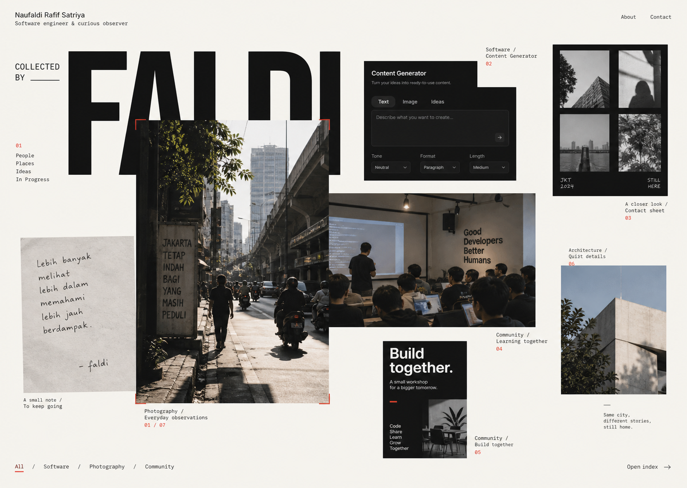

### About

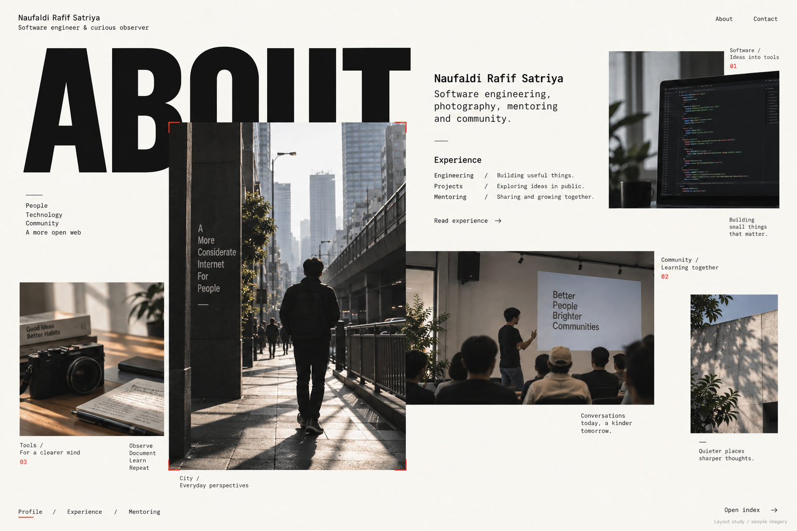

### Projects

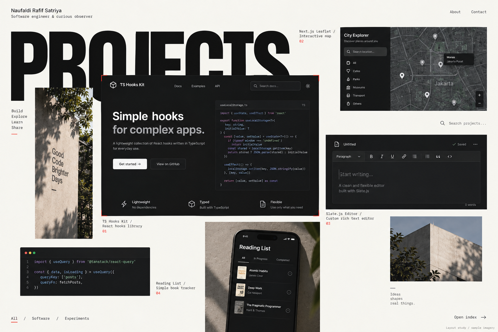

### Community

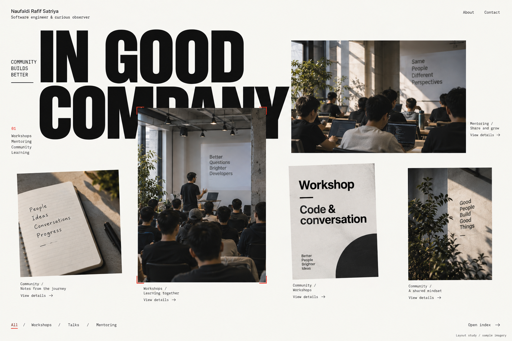

### Writing

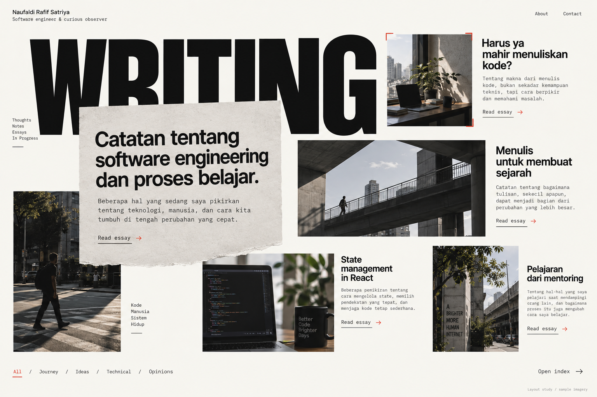

### Shorts

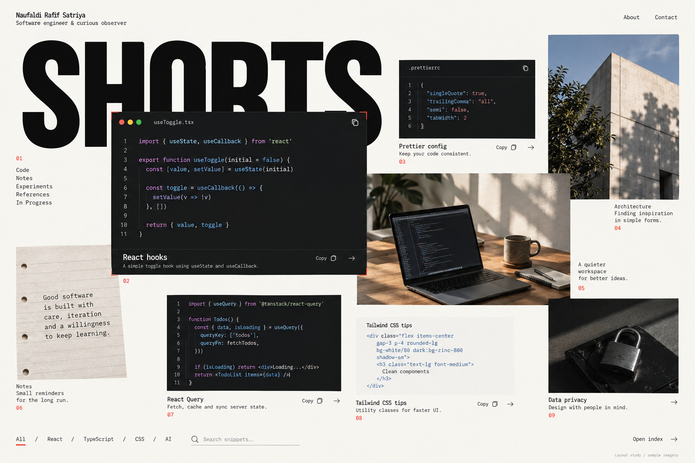

### Books

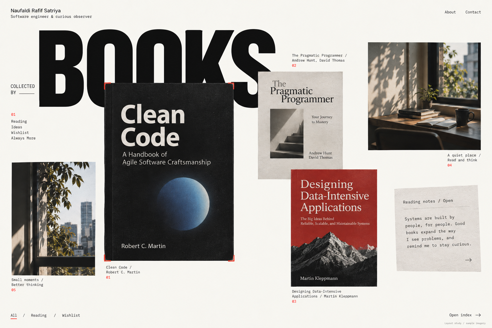

### Manhwa

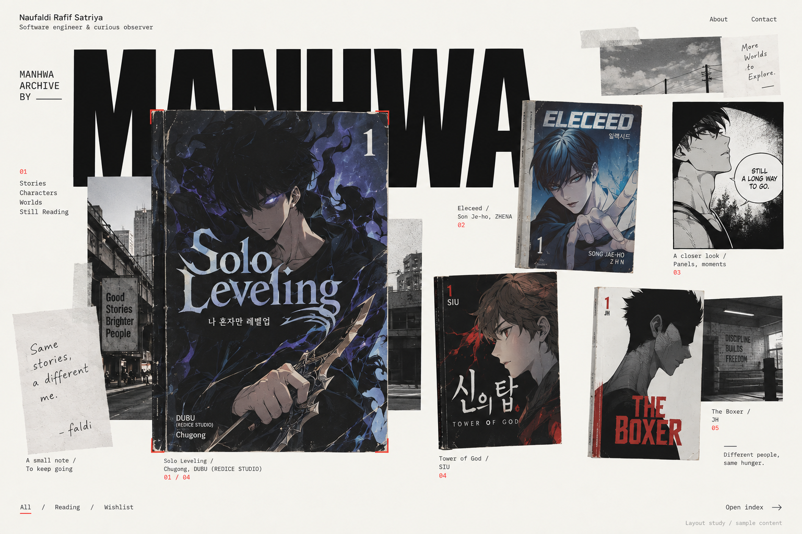

### Project detail

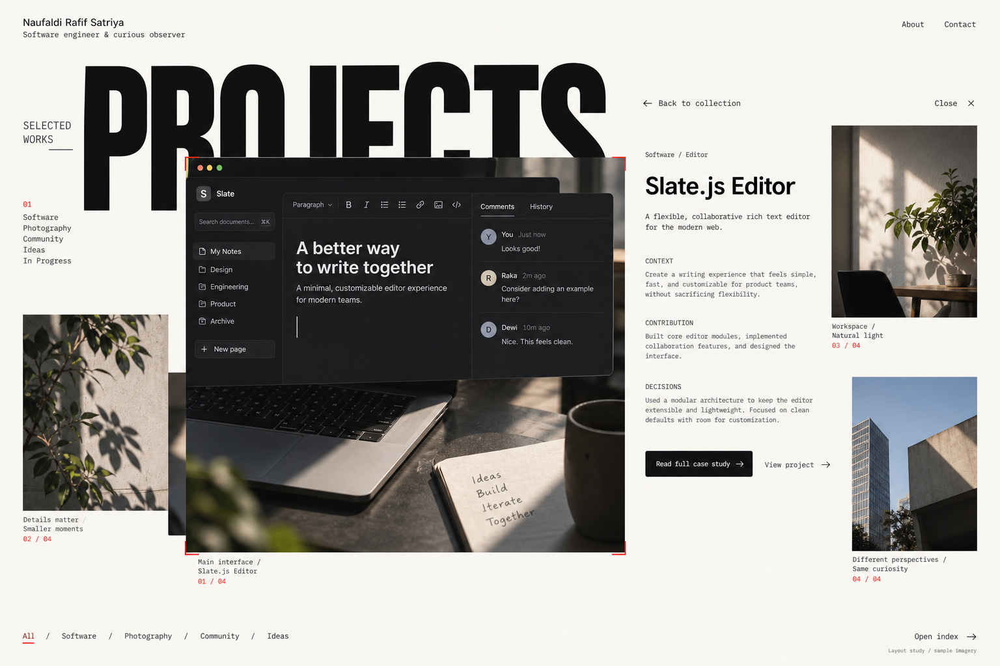

### Writing / short detail

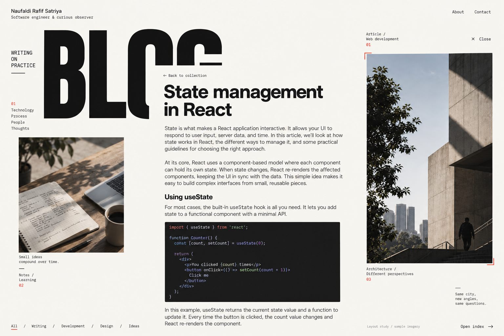

### Community detail

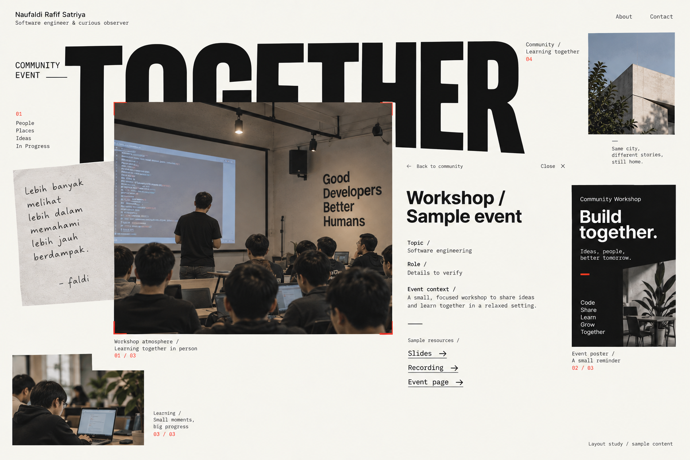

### Book detail

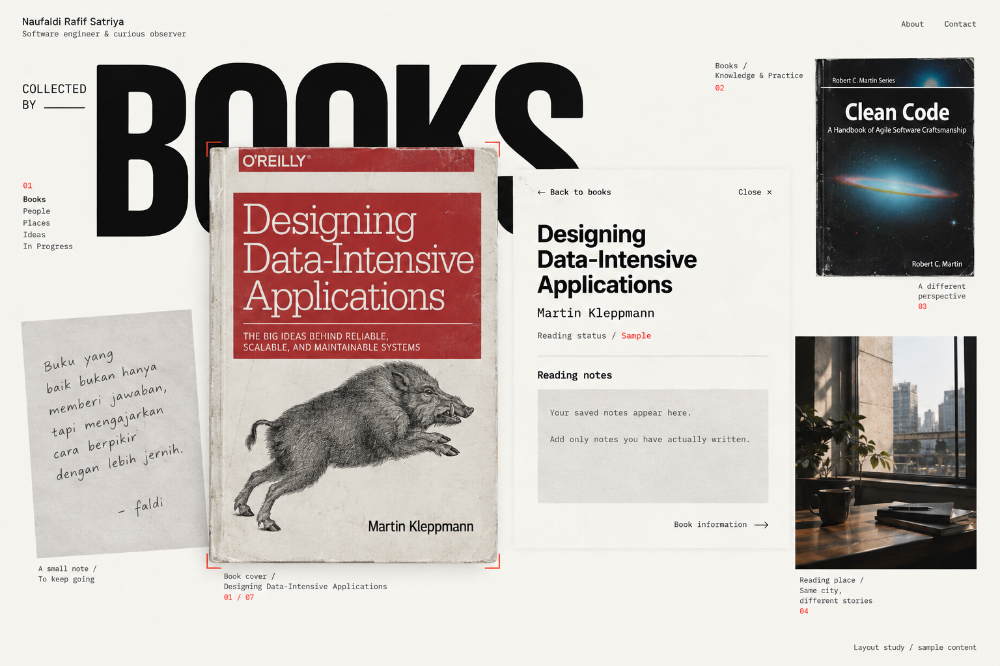

### Manhwa detail

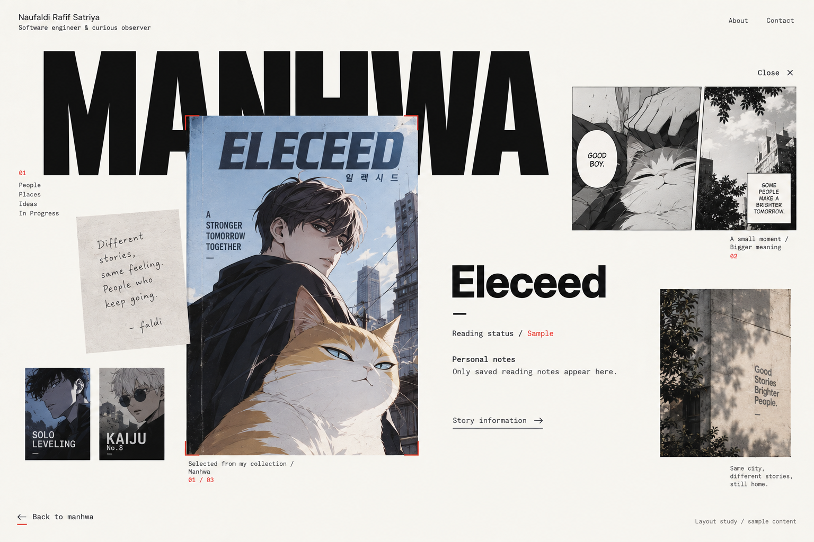

## Superseded boards

[Archive](archive/README.md): retained for history only. Do not implement their conventional stacked-section layouts.
