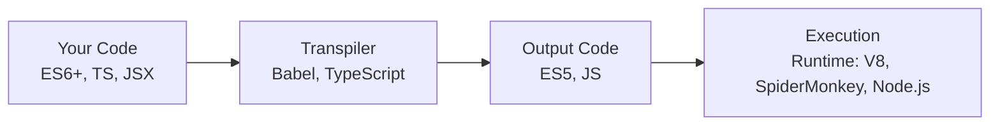

# Compiler vs Transpiler: My Journey from JS/TS to Golang Clarity

Since yesterday, I’ve been learning about compilers and transpilers to better understand the difference between Golang and JavaScript as languages.

Before we go into that, we need to understand that there are 3 software translation levels according to the course I’m taking.

## Software Translation (How the computer understands code)

There are 3 levels:

1. **Machine Language**

   The CPU’s native language: binary numbers. Humans really don’t want to read this.

2. **Assembly**

   Still close to the CPU, but already using short mnemonics like `MOV`, `ADD`.

   Easier to read than pure binary, but still low-level.

3. **High-Level Language**

   The language humans like to write. Examples: Go, Python, Java, C, JavaScript.

Analogy:

Machine language = robot sounds _beep‑boop_

Assembly = short, military-style language

High-level = human language

So, Golang and JavaScript both live in this high-level language group. But what makes Go and JavaScript feel so different?

## How Go Runs My Code (Compiled)

Go is a **compiled language**.

When I run `go build`, the Go compiler takes my `.go` files and:

1. Reads and checks the code (syntax and types).
2. Optimizes it so it runs faster on the target CPU.
3. Translates it into machine instructions (machine language, level 1).
4. Links in all the libraries it needs into a single binary file.

The result is a single binary file, that can be run directly by the OS and CPU.

At this level, humans can’t really read it anymore, because it’s machine instructions, not high-level code.

## How JavaScript Runs My Code (Transpiler + Engine + JIT)

JavaScript has a different story.

JavaScript itself is **not a “transpiler language”**. The transpilers are the tools around it, like **Babel** or the **TypeScript compiler**, which convert:

- Modern JavaScript / TypeScript → another version of JavaScript (often ES5) that’s more compatible.

After that, JavaScript is still shipped as **source code**, and then:

1. The JavaScript engine (like V8 in Node/Chrome) reads the source code.
2. The engine parses it into an AST and bytecode.
3. The code starts executing in an interpreter.
4. Hot paths (code that runs often) get **JIT-compiled** into machine code so they run faster.

So the pipeline is roughly:

Modern JS/TS → (Transpiler: Babel/TS) → plain JS → (Engine: V8) → interpret + JIT → machine code.

There is no single standalone binary file like in Go. We ship source code and need a runtime (browser or Node.js) to execute it.

If I want to create an analogy, it’s like this:

### **Compiled**

The movie is fully rendered into a final file first.

You can play it instantly, as many times as you want.

### **Interpreted**

There is no movie file.

There’s a director performing the scenes live every time there’s an audience.

### **JIT**

The director still performs scenes live.

But when they notice some scenes are repeated a lot, they quickly record those scenes so they can play them faster later.

## Visual Diagram

### Compiler Flow

## Example with Go

Let’s take an example of Go.

In this case, I have a Go file, then I try to build it.  

I already have a bash script to run, so it shows more details about what happens.  

Here we can see there is a new file named `program`.

We can run `program` with `./program`, but we can’t really open it and “read” it, because it’s already CPU instructions, not high-level code.

## Example with JavaScript

On the other hand, for JavaScript, we don’t get a single binary file.

Usually, modern JavaScript (or TypeScript) is first **transpiled** down to older JavaScript (ES5) by Babel (a JavaScript transpiler tool). The output is still source code, still human-readable JavaScript.

Then, when it runs in Node.js or the browser, the V8 engine will:

- Parse that JavaScript,
- Execute it with an interpreter,
- And **JIT-compile** frequently used parts into machine code.

That’s why in JavaScript we don’t “build a binary” like Go. Instead, we transpile it into another form of JavaScript, then let an engine (Node.js or the browser) handle the execution.

At this point, we can still see and read the code because it’s still high-level language (JavaScript), not machine language.

That’s the difference between these two worlds: both are high-level languages, but **how** the code is transformed and read by the machine is very different.

Go: compile once into a binary → CPU runs it directly.  
JavaScript: (optionally) transpile → engine reads source → interpret + JIT.

This is one of the reasons why Go, with its compiled model, often feels faster and more predictable compared to JavaScript, which goes through layers of transpiler + interpreter + JIT.
