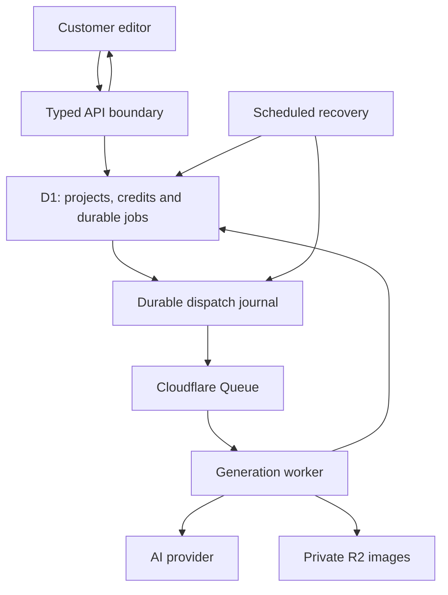

## Why I worked on this

Content Generator turns a prompt into an editable carousel. A user can generate slides, change the copy, and work with images. Each paid operation also changes a credit balance.

That last detail changes the engineering problem. A failed request can leave the user without a result even though the system has already reserved credits or called an external provider. Showing an error message does not put the data back into a consistent state.

My focus was the connection between the interface, the API, background generation, and accounting. I used AI coding agents for implementation and review, with the work checked through failure tests and local browser flows. This case study describes that work and its evidence, not a claim that I wrote every line manually.

## Current status

The application has been deployed to Cloudflare. The September 5 release record includes the database migration and API, customer, and admin deployments. A fresh read-only health request returned HTTP 200 with `{"ok":true}`.

The recovery scenarios below were tested with local D1/Worker bindings and fake providers. They are not production outage tests. The release checks did not include live paid generation, so I do not claim that they verified provider billing or successful real-provider output. The source repository is private; the evidence on this page is self-contained.

## How the pieces fit

The API validates the request and records durable state. The queue runs generation outside the browser request. D1 holds ownership, progress, accounting, and the information recovery needs. The editor reads the saved outcome instead of depending on one request staying alive.

## Decision 1: recovery needs durable state

An in-memory error handler can run only while its process is alive. A Worker can stop between a debit, a provider response, and saving the result. I needed the next execution to know what had already happened.

The remediation added durable job claims and checkpoints. A claim gives one attempt permission to work. An attempt token prevents an old worker from saving a late result after another attempt takes ownership. A saved checkpoint lets a later attempt reuse a completed provider result.

This costs additional state and database writes. I accepted that complexity because credits and external calls cannot safely depend on a browser connection or process memory.

## Decision 2: an unknown result is not a safe retry

A timeout tells me that I did not receive a usable response. It does not tell me whether the provider accepted the work.

The implementation records an ambiguous in-flight result rather than automatically repeating the paid call. Explicit rate-limit rejections can retry within a bounded deadline, respecting the provider's retry guidance. An uncertain server error does not get the same treatment.

The tradeoff is deliberate: some interrupted operations need compensation instead of automatic completion. A working retry button is not worth silently repeating a paid operation.

## What the failure tests establish

On September 5, I reran five selected test files against source revision `00411bd5eba9ea2c1cbece3eee1d31dac2d3c40e`. All 70 tests passed.

- **Two deliveries overlap:** only the owning attempt reaches the provider checkpoint.
- **Ownership expires after a result is saved:** the next attempt reuses the saved result; the old attempt is fenced out.
- **A provider call was started but its result is unknown:** recovery records ambiguity and does not blindly replay the call.
- **A refund response is lost after commit:** recovery finishes with one refund ledger entry and the original test balance restored.
- **Settlement commits but the acknowledgement is lost:** recovery resumes the saved state without repeating the completed provider work.
- **An editor change fails to persist:** charged-operation tests cover content/accounting recovery and the boundary between applying a result and refunding it.

The crash tests reconstruct the durable state left by an interruption and run recovery against it. They do not physically terminate a production Worker. That distinction matters when describing reliability.

[Read the evidence and reproduction guide](/evidence/content-generator/README.txt) · [Read the sanitized test output](/evidence/content-generator/reliability-tests.txt)

## The frontend bug that made the boundary visible

During the earlier local browser checks, an AI edit changed the stored balance but the sidebar still displayed its previous value. The cache producer updated the session data; the sidebar was not reactively subscribed to that change.

The fix connected the consumer to the cache updates. Repeating the edit showed 88 credits in both the sidebar and the API response. A separate forced save failure kept the previous content and restored the balance. The screenshot below records the local successful-edit state; the database and API assertions establish the accounting behavior.

This screenshot comes from the September 5 remediation run. The 70-test run above was repeated separately for this case study.

## What I learned

I started from visible behavior: a generation result, an error, and a balance in a sidebar. Following those values through the system made the real problem clearer. Each operation needs an owner, durable progress, and a defined terminal state.

My frontend experience helped me notice stale state. Working through the backend made me ask a harder question: what should the next execution do when the previous one stopped halfway through?

## What remains

Live-provider verification and operating evidence are separate work. I still need measured completion rates, cost per successful generation, and recovery observations under actual usage before making claims about production reliability at scale. Demo credits are not evidence of payment processing.
