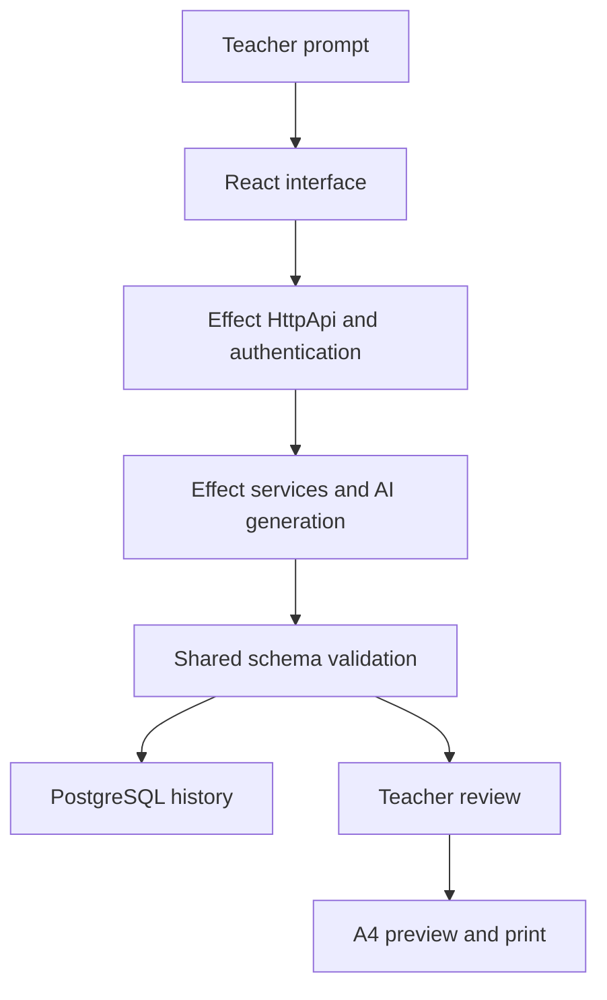

## Why I built this

I wanted an exam generator that fits how Indonesian elementary-school teachers prepare a worksheet. A useful result needs questions, answer keys, explanations, and a layout that can be printed on A4 paper.

The project takes a short prompt through generation, review, and printing. My work spans the React interface, API contracts, persistence, authentication, and deployment. I used AI coding agents during implementation and verification. My responsibility is the product scope, engineering decisions, and checking the result.

## Current status

The deployed website returned HTTP 200 during the September 5 portfolio checks. That is a reachability check, not proof that every authenticated generation flow works.

The repository documents generation, review, history, and print workflows. I have not attached a measured teacher pilot to this case study yet, so I do not claim hours saved, a specific review time, or improved learning outcomes.

## The problem with a convincing answer

An AI response can look like a finished exam while missing classroom requirements. The question types may be inconsistent. An answer key can disagree with a question. Long text can also make a reasonable-looking preview awkward to print.

I treated generation as one step in a review workflow. Structured output gives the application a predictable shape, while the teacher remains responsible for checking whether the questions and explanations are suitable.

## How the system fits together

The web app and API share schemas. PostgreSQL stores the saved work. Docker and Caddy support the VPS deployment. I kept these responsibilities separate so I could reason about a bad output, a persistence failure, and a print problem independently.

## Decision 1: share the data contract

The generated exam has to survive several transitions: provider output, API response, saved record, review screen, and print layout. Defining those shapes independently would make it easy for them to drift.

I used shared schemas at the application boundary. That adds validation work, but it catches malformed output before the UI treats it as a valid exam. A schema can check structure; it cannot establish that an answer is educationally correct. The review step remains necessary.

## Decision 2: design around review and printing

I wanted the teacher to work with a structured worksheet instead of copying a chat response into another document. The same exam data feeds the review and print views.

This makes print layout part of the product rather than a final export detail. It also creates concrete cases to verify: long questions, mixed item types, answer keys, and page breaks. Keeping those cases visible is more useful than adding another generation option before the existing output is easy to review.

## Evidence I can show

The public repository includes the web/API/shared-schema layout, deployment notes, and local verification screenshots. Those artifacts let a reviewer inspect the implementation and recorded UI states.

- [Repository and local setup](https://github.com/naufaldi/teacher-exam)
- [Recorded browser screenshots](https://github.com/naufaldi/teacher-exam/tree/main/screenshots)
- [Shared contracts](https://github.com/naufaldi/teacher-exam/tree/main/packages/shared)
- [Live website](https://ujian-sekolah.naufaldi.com)

I am separating documented capabilities from measured impact. The next useful evidence is a small teacher pilot: can a teacher produce an acceptable worksheet, how much editing is required, and what gets in the way?

## What I learned

Building the interface was only part of making this useful. The data contract determines what the interface can trust, and the review flow determines what the teacher can correct. A technically valid response is still only a draft until someone checks the content.

## A concrete problem found in the public workflow

During the September 5 browser check, the public bank contained a class 2 worksheet but its grade filter offered only classes 5 and 6. The records and the filter were describing different scopes.

I traced the filter to a hardcoded two-grade list. The shared grade schema already supports classes 1–6. I changed the options to derive from that schema, then checked that selecting class 2 sends `grade: 2` and resetting removes the grade filter. This was an engineering observation, not feedback from a teacher pilot.

The regression failed before the change because option 2 did not exist. After the fix, 96 selected local review, preview, and public-bank tests passed in a serial run. These are component tests with mocked APIs; they do not establish real teacher completion times.

[Read the workflow verification](/evidence/teacher-exam/workflow-checks.txt)

The current checkout uses Effect HttpApi. Earlier project notes described its Hono implementation; this diagram reflects the code checked for this update.

## Try the workflow and share feedback

[Open the teacher pilot](/pilot/teacher-exam/) for a short task guide and a local feedback download. No observations are collected automatically. Teachers can review their notes and choose whether to send them to me.

[Take the five-minute engineering walkthrough](/demos/fullstack-walkthrough/) to compare this product workflow with the Content Generator recovery work.

## What remains

I plan to observe 3–5 willing teachers completing the review and print workflow. I will record completion, corrections, and review time, then fix the largest repeated obstacle. Those observations have not happened as part of this case study. A small pilot will also need to be described as a small sample, not a claim about every teacher.
